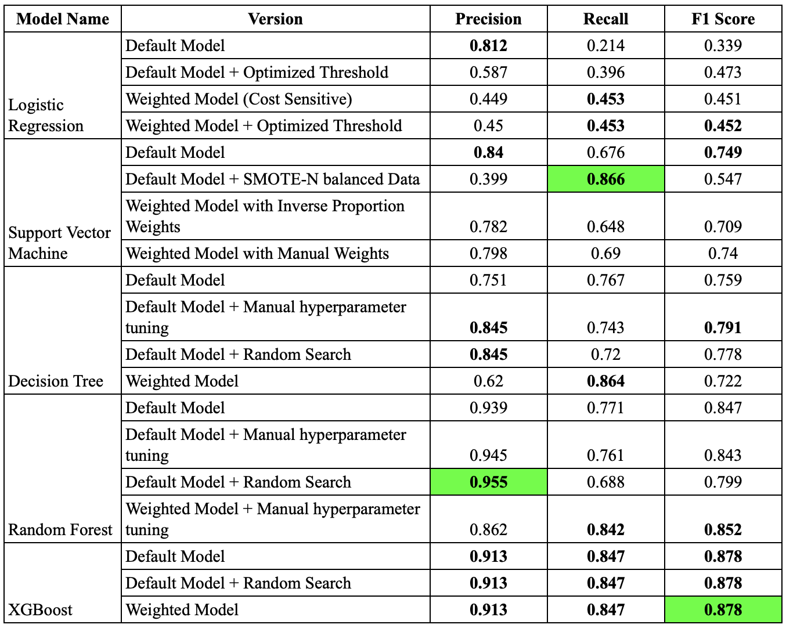

# Overview and Objectives
A car reseller company is planning to launch a marketing campaign targeting potential buyers. The project aims to develop a classification model to predict if an existing customer will re-buy a new car or not.

The project consists of 2 main phases:

1. **Exploratory Data Analysis**: Gain a comprehensive understanding of the dataset, which includes statistical descriptive, univariate analyis, bivariate analysis and multivariate analysis.

2. **Developing Machine Learning Models**: The project developed and bencmarked various models to classify whether a customer will rebuy a car or not based on their available information such as demographic and historical data.

By applying a data-driven approach to predict whether a customer will rebuy a car or not, the company can benefit from:

1. Focusing on the right potential customers, which help in increasing sales and ROI (return on investment).

2. Saving necessary costs and resources needed for non-potential customers.

3. Enhanced Customer Relationships by understanding their needs and preferences.

4. Optimizing and Personalizing Marketing Campaigns based on customer information and interests.

# Dataset
The dataset can be downloaded [here](https://drive.google.com/file/d/1QuqWk6xA8e-3yunBasnp6QtJLRrvFtiz/view?usp=sharing). The original dataset is collected from an online learning platform and consists of **131,337 samples** with **17 features**. It contains customer demogaphics (age band, gender), their past vehicle characteristics (model, segment, age, etc) and historical services (number of paid/unpaid services, total paid amount, last service time, etc.).

The dataset was then separated into 3 different datasets: **60%** for training, **20%** for validation and **20%** for testing.

# Methodologies
## Exploratory Data Analysis
The EDA stage can be summarised as:
- Data cleaning (identifying missing values, duplicated values, outliers, etc.)
- Univariate Analysis (Distribution plot, Log transformation, IQR outliers detection, etc.)
- Bivariate Analysis (Kernel Density Estimation analysis, Spearman rank matrix correlation, Hypothesis testing, ...)

## Model Development
Various machine learning models were experimented, which includes:
- Logistic Regression
- Support Vector Machine
- Decision Tree
- Random Forest
- XGBoost

Since the dataset was heavily imbalance, [SMOTE-NC (Synthetic Minority Over-sampling Technique for Nominal and Continuous)](https://imbalanced-learn.org/stable/references/generated/imblearn.over_sampling.SMOTENC.html) technique was leveraged to generate synthetic data for re-purchased customer group. Additionally, **Cost Sensitive Learning** was also exprimented to force the models to focus more on the minority class.

[Cross Validation](https://scikit-learn.org/stable/modules/generated/sklearn.model_selection.cross_validate.html) was adopted for more robust model evaluation.

In order to achieve better performance, [Random Search](https://en.wikipedia.org/wiki/Random_search#:~:text=Random%20search%20(RS)%20is%20a,%2C%20or%20black%2Dbox%20methods.) and manual hyperparameters tuning were also used to optimize model's hyper-parameters. 

Last but not least, [Precision-Recall Curve](https://scikit-learn.org/stable/modules/generated/sklearn.metrics.precision_recall_curve.html) was utilized to determine classification threshold that achieve the best peformance.

## Models Benchmarking
The figure below summarizes the performance of all exprimented models:

Notes:

- The scores that are printed in bold are the highest scores of that metric **among all experiments on the same model**.
- The scores that are highlighted with color are the highest scores of that metric **among all experiments (all models)**.

As illustrated in the table, **Weighted XGBoost** achieved the highest F1 score on the test dataset, while **Support Vector Machine with SMOTE-N** achieved the highest Recall score (just slightly higher than that of XGBoost model).

If the company only wants to focus on finding all potential customers, we should take the model with the highest recall score instead of F1 score. Otherwise, if the company also wants to save the marketing cost by mitigating false positive case (identify a non-rebuy customer as a rebuy customer), we should take the model with the highest F1 score.

# Business Impacts and Concerns
## Business Impact Quantification
The XGBoost model can capture nearly **85%** of all rebuy customers, missing only **15%** of total potential customers, which can help the company to maximize their chance to gain profit from these customers.

By accurately classify customer group, the model can help the company in:
- Focusing on the right potential customers, which help in increasing sales and ROI (return on investment).
- Saving necessary costs and resources needed for non-potential customers.
- Enhanced Customer Relationships by understanding their needs and preferences.
- Optimizing and Personalizing Marketing Campaigns based on customer information and interests.

## Ethical Concerns
### Data Privacy
- **Sensitive Data Collection**: The customers can be unaware of sensitive data collected such as purchasing history, service history or demographic. The data collection process should be transparent to customers and require their consent to start.
- **Data Breaches**: Data that are stored or used for modeling may not be encrypted and can be leaked to third party organizations. In order to protect the data, the company should perform strong data security measures (data encryption, access control, etc.) and ensure the usage of data of third party organizations.

### Ethical Concern
- **Model Bias**: Bias training data can lead to unfair output (for instance, customers who paid more for services in the past are more likely to buy new cars). The model that is used in production should be easy to interpret, if necessary. Bias features should also be considered to exclude while building the model.
- **Customer Boundaries**: The customers the company is targeting may not be comfortable with constant marketing. The company should balance between performing necessary marketing campaigns and respecting customers’ boundaries.

